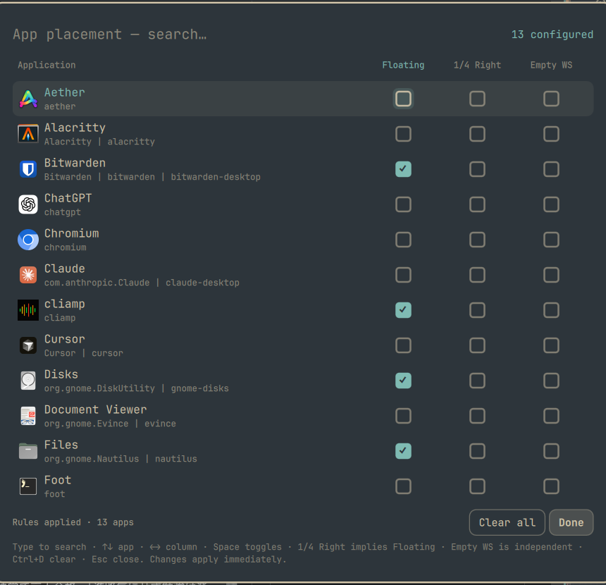

# App Placement for Omarchy

Per-app window placement settings for [Omarchy](https://omarchy.org/). Open
the panel, find an app, tick **Floating**, **1/4 Right** and/or **Empty WS**,
done: from then on that app opens floating, docked to the right quarter of
the screen, or on a fresh empty workspace, no matter how you launch it
(menu, keybind, terminal, another app).



It is a settings panel, not a launcher. The ticks become Hyprland window
rules, so the compositor places the window before it is first shown: no
flash of a tiled window, no per-launch flags.

## Install

```bash
omarchy plugin add https://github.com/ioiohori/omarchy-app-placement.git --enable
```

Bind a key in `~/.config/hypr/bindings.lua`:

```lua
o.bind("SUPER + SHIFT + Q", "App placement settings", "omarchy-shell shell toggle ioiohori.app-placement")
```

`omarchy plugin enable` also puts a button on the bar (next to the Omarchy
menu). Move or remove it with `omarchy bar move` / `omarchy bar` like any widget.

Optional: let `SUPER + W` close the panel too. Omarchy binds it to "close
window", so the plain bind would close the app behind the overlay. This
version checks for the panel's layer surface first, inside Hyprland, so the
normal case stays instant:

```lua
hl.unbind("SUPER + W")
o.bind("SUPER + W", "Close window", function()
  for _, layer in ipairs(hl.get_layers({ namespace = "omarchy-app-placement" }) or {}) do
    if layer.mapped then
      hl.exec_cmd("omarchy-shell shell hide ioiohori.app-placement")
      return
    end
  end
  hl.dispatch(hl.dsp.window.close())
end)
```

## Remove

```bash
omarchy plugin remove ioiohori.app-placement
rm -f ~/.local/state/omarchy/toggles/hypr/app-placement.lua ~/.local/state/omarchy/app-placement.json
hyprctl reload
```

The first line removes the plugin checkout and disables it. The second deletes
the generated rules and saved settings (the only files the plugin writes
outside its own directory), and the reload drops the rules from Hyprland.

## Dependencies

Nothing beyond a stock Omarchy 4.x install: `omarchy-shell` (Quickshell 0.3),
Hyprland with the Lua config, and `hyprctl` for reload / monitor queries.
No sudo or pkexec is required. Node.js is only needed to run the tests.

## Use

| Key | Action |
|-----|--------|
| type | filter the list (name, description, keywords, id) |
| `↑` `↓` | move between apps |
| `←` `→` / `Tab` | move between the Floating, 1/4 Right and Empty WS columns |
| `Space` / `Enter` / click | toggle the highlighted checkbox |
| `Ctrl+D` | clear every setting |
| `Esc` | clear the filter, then close |
| `SUPER + W` | close (with the optional bind above) |

Rules:

- **Floating** opens the app's main window floating (Hyprland centers it).
- **1/4 Right** opens it floating in a full-height column a quarter of the
  screen wide, against the right edge, below the bar. Ticking it also ticks
  Floating; unticking Floating clears both.
- **Empty WS** opens it on the first empty workspace of the focused monitor
  (Hyprland's `emptym`) and switches to it. It is independent of the other
  two, so a tiled app can get a workspace of its own.
- Changes apply immediately. The status line shows `Rules applied` or the
  `hyprctl configerrors` output if Hyprland rejected the file.
- Dialogs and other child windows of the app are left alone.

## Scripting

```bash
# Set one app without the UI.
omarchy-shell shell call ioiohori.app-placement set '{"id":"org.gnome.Nautilus","float":true,"quarter":true,"emptyws":false}'
# Clear it.
omarchy-shell shell call ioiohori.app-placement set '{"id":"org.gnome.Nautilus"}'
# Recompute the geometry for the current monitor and rewrite the rules
# (for example from a monitor hook).
omarchy-shell shell call ioiohori.app-placement regenerate ''
```

## How it works

- Apps come from Quickshell's `DesktopEntries`, minus `NoDisplay` entries and
  Omarchy's `launcher.hides` list.
- The window class is guessed from `StartupWMClass`, the desktop id and the
  executable name; all candidates are matched (`^(org\.gnome\.Nautilus|nautilus)$`)
  and shown under the app name so you can see what will be matched.
- Settings live in `~/.local/state/omarchy/app-placement.json`. On every
  change the plugin writes `~/.local/state/omarchy/toggles/hypr/app-placement.lua`
  and runs `hyprctl reload`. Omarchy re-requires that directory on every
  reload, so nothing in `~/.config/hypr` needs editing, and the file is
  loaded after your own config, so these rules win on conflict.
- The generated rule looks like this:

  ```lua
  hl.window_rule({ match = { class = "^(org\\.gnome\\.Nautilus|nautilus)$", float = false },
    workspace = "emptym", float = true, size = { 384, 934 }, move = { 1152, 26 } })
  ```

  `float = false` in the match restricts it to the main window: Hyprland
  already treats parented toplevels (dialogs) as floating before rules run.
  The size and position are pixels for the focused monitor (logical size
  minus the reserved area, so the bar is respected), recomputed whenever a
  setting is saved or the panel is opened on a changed layout. Hyprland's
  `%` and `monitor_w` forms were tested and either ignored or overlapped the
  bar, hence pixels.

### Known limits

- Apps whose window class cannot be guessed from the desktop entry (some
  Chrome web apps, wrappers) will not match. Check the grey class line under
  the app name; add a `StartupWMClass=` to a local copy of the `.desktop`
  file if needed.
- With several monitors the column is sized for the focused monitor at save
  time. Call `regenerate` from a monitor hook if you switch often.

## Development

```bash
git clone https://github.com/ioiohori/omarchy-app-placement.git ~/.config/omarchy/plugins/ioiohori.app-placement
omarchy plugin validate ~/.config/omarchy/plugins/ioiohori.app-placement
node tests/placement.test.js     # pure logic: class guessing, geometry, generated Lua, state
omarchy restart shell            # keepLoaded plugin: QML edits need a restart
```

## 日本語

アプリごとのウィンドウ配置を設定するパネルです(ランチャーではありません)。
一覧からアプリを探して **Floating** / **1/4 Right** / **Empty WS** にチェックを入れると、
そのアプリはどこから起動しても floating、画面右 1/4 の縦長カラム、空のワークスペース(Empty WS、他 2 つとは独立)で開きます。

- インストール: `omarchy plugin add https://github.com/ioiohori/omarchy-app-placement.git --enable`
- キー割り当て: `o.bind("SUPER + SHIFT + Q", "App placement settings", "omarchy-shell shell toggle ioiohori.app-placement")`
- SUPER+W でも閉じたい場合は上記 Install 節の Lua スニペットを bindings.lua に追加(パネルが出ていなければ従来どおりウィンドウを閉じる)
- 仕組み: チェック内容から `~/.local/state/omarchy/toggles/hypr/app-placement.lua` に Hyprland のウィンドウルールを生成し `hyprctl reload` します。Omarchy がこのディレクトリを reload のたびに読み直すので、hyprland.lua の編集は不要です。
- 1/4 Right にチェックすると Floating も自動で入ります。ダイアログ等の子ウィンドウには適用されません。

## License

MIT
